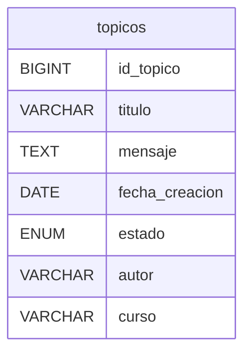

# Challenge ONE | Back End | Foro Alura 

     

     
     

---
¡Bienvenido al proyecto con mi solución al desafío Foro Alura con Java y Spring! 

---

## 🗄️ Base de datos

## 🖥️ Tecnologías Utilizadas:

- [Eclipse](https://www.eclipse.org/)
- [MySql](https://www.mysql.com/)
- [Java](https://www.java.com/en/)

- [Spring Security](https://start.spring.io/)
- [Token JWT](https://jwt.io/)

## 📷 Capturas
## ⚙️ Indicaciones para ejecución desde IDE
