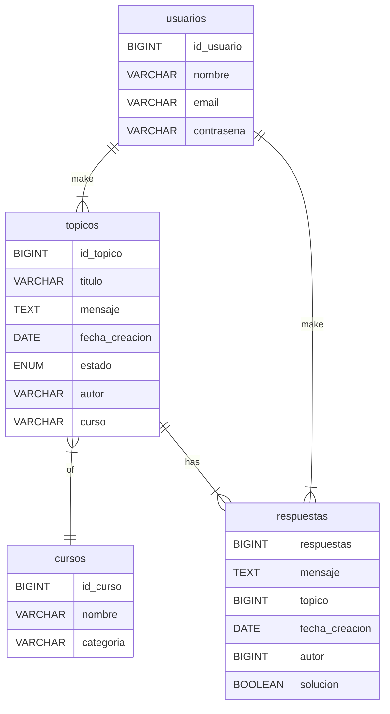

# Challenge ONE | Back End | Foro Alura 

<div align="center" >
     
</div>

<div align="center">
     <a href="https://www.linkedin.com/company/oracle/">
          
     </a>
     <a href="https://www.linkedin.com/company/alura-latam/mycompany/">
          
     </a>

---
¡Bienvenido al proyecto con mi solución al desafío Foro Alura con Java y Spring! 

---
</div>

## 🗄️ Base de datos



## 🖥️ Tecnologías Utilizadas:

- [Eclipse](https://www.eclipse.org/)
- [MySql](https://www.mysql.com/)
- [Java](https://www.java.com/en/)

- [Spring Security](https://start.spring.io/)
- [Token JWT](https://jwt.io/)

## ⚙️ Indicaciones para ejecución desde IDE

1. Ejecutar script sql de la carpeta db en su sistema gestor de base de datos de mysql. Yo usé MySQL Workbench.
2. Importar el proyecto a su espacio de trabajo.
3. Asignar las variables de entorno siguientes en su IDE.
     - (Opcional) MYSQL_HOST: el host de tu base de datos, si usas localhost puedes omitirlo
     - MYSQL_USER: tu usuario de mysql
     - MYSQL_PASSWORD: tu contraseña de mysql
     - SECURITY_SECRET: cualquier string, yo le puse "quesadilla"
4. Una vez en ejecución, puedes utilizar postman para realizar las peticiones, pero primero debes realizar una petición a "/login" con los datos de algún usuario de la base de datos para recibir un token con el que podrás realizar peticiones a cualquier otro endpoint por hasta 2 horas. Pasando las 2 horas, tendrás que loggearte de nuevo.

## Samples
### Usuarios
- GET http://localhost:8080/usuarios
```json
{
    "_embedded": {
        "usuarios": [
            {
                "id": 1,
                "nombre": "Saul Malagon",
                "email": "saul@mail.com",
                "_links": {
                    "self": {
                        "href": "http://localhost:8080/usuarios/1"
                    },
                    "usuarios": {
                        "href": "http://localhost:8080/usuarios"
                    }
                }
            },
            {
                "id": 2,
                "nombre": "Daniel Juarez",
                "email": "daniel@mail.com",
                "_links": {
                    "self": {
                        "href": "http://localhost:8080/usuarios/2"
                    },
                    "usuarios": {
                        "href": "http://localhost:8080/usuarios"
                    }
                }
            }
        ]
    },
    "_links": {
        "self": {
            "href": "http://localhost:8080/usuarios"
        }
    }
}
```

- GET http://localhost:8080/usuarios/1
```json
{
    "id": 1,
    "nombre": "Saul Malagon",
    "email": "saul@mail.com",
    "_links": {
        "self": {
            "href": "http://localhost:8080/usuarios/1"
        },
        "usuarios": {
            "href": "http://localhost:8080/usuarios"
        }
    }
}
```

- POST http://localhost:8080/usuarios

Request
```json
{
    "nombre": "Alejandro Lopez",
    "email": "alopez@mail.com",
    "contrasena": "1234"
}
```

Response
```json
{
    "id": 3,
    "nombre": "Alejandro Lopez",
    "email": "alopez@mail.com",
    "_links": {
        "self": {
            "href": "http://localhost:8080/usuarios/3"
        },
        "usuarios": {
            "href": "http://localhost:8080/usuarios"
        }
    }
}
```
- POST http://localhost:8080/usuarios

Request
```json
{
    "id": 3,
    "email": "alex.lopez@mail.com"
}
```
Response
```json
{
    "id": 3,
    "nombre": "Alejandro Lopez",
    "email": "alex.lopez@mail.com",
    "_links": {
        "self": {
            "href": "http://localhost:8080/usuarios/3"
        },
        "usuarios": {
            "href": "http://localhost:8080/usuarios"
        }
    }
}
```
- DELETE http://localhost:8080/usuarios/3

Response
```
Status Code: 204 No Content
```