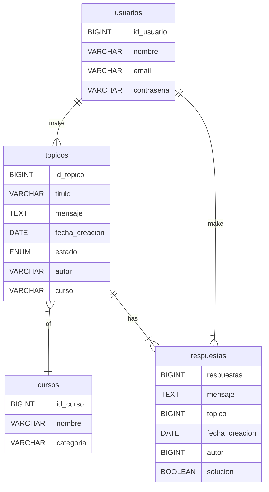

# Challenge ONE | Back End | Foro Alura 

     

     
     

---
¡Bienvenido al proyecto con mi solución al desafío Foro Alura con Java y Spring! 

---

## 🗄️ Base de datos

## 🖥️ Tecnologías Utilizadas:

- [Eclipse](https://www.eclipse.org/)
- [MySql](https://www.mysql.com/)
- [Java](https://www.java.com/en/)

- [Spring Security](https://start.spring.io/)
- [Token JWT](https://jwt.io/)

## ⚙️ Indicaciones para ejecución desde IDE

1. Ejecutar script sql de la carpeta db en su sistema gestor de base de datos de mysql. Yo usé MySQL Workbench.
2. Importar el proyecto a su espacio de trabajo.
3. Asignar las variables de entorno siguientes en su IDE.
     - (Opcional) MYSQL_HOST: el host de tu base de datos, si usas localhost puedes omitirlo
     - MYSQL_USER: tu usuario de mysql
     - MYSQL_PASSWORD: tu contraseña de mysql
     - SECURITY_SECRET: cualquier string, yo le puse "quesadilla"
4. Una vez en ejecución, puedes utilizar postman para realizar las peticiones, pero primero debes realizar una petición a "/login" con los datos de algún usuario de la base de datos para recibir un token con el que podrás realizar peticiones a cualquier otro endpoint por hasta 2 horas. Pasando las 2 horas, tendrás que loggearte de nuevo.

# Foro Alura API DOCS
Practice project - Alura Challenge ONE

## Version: 1.0.0

**Contact information:**  
Saul Malagon Martinez  
smalagonmtz@gmail.com  

### /usuarios

#### GET
##### Summary:

Obtiene una lista paginada de todos los usuarios

##### Parameters

| Name | Located in | Required | Schema |
| ---- | ---------- | -------- | ---- |
| page | query | No | integer |
| pageSize | query | No | integer |
| sortBy | query | No | string |
| orderBy | query | No | string |

##### Responses

| Code | Description |
| ---- | ----------- |
| 200 | OK |

##### Security

| Security Schema |
| --- |
| Foro_Alura_Auth |

#### PUT
##### Summary:

Modifica la información de un usuario

##### Description:

Solo los usuarios con rol `ADMIN` pueden modificar la información de cualquier usuario, los usuarios sin rol `ADMIN` solo pueden modificar su propia información.

##### Responses

| Code | Description |
| ---- | ----------- |
| 200 | OK |

##### Security

| Security Schema |
| --- |
| Foro_Alura_Auth |

#### POST
##### Summary:

Crea un nuevo usuario

##### Responses

| Code | Description |
| ---- | ----------- |
| 200 | OK |

##### Security

| Security Schema |
| --- |
| Foro_Alura_Auth |

### /topicos

#### GET
##### Summary:

Obtiene una lista paginada de todos los topicos

##### Parameters

| Name | Located in | Required | Schema |
| ---- | ---------- | -------- | ---- |
| page | query | No | integer |
| pageSize | query | No | integer |
| sortBy | query | No | string |
| orderBy | query | No | string |

##### Responses

| Code | Description |
| ---- | ----------- |
| 200 | OK |

##### Security

| Security Schema |
| --- |
| Foro_Alura_Auth |

#### PUT
##### Summary:

Modifica la información de un tópico

##### Description:

Solo el autor del tópico o un usuario con rol `ADMIN` pueden modificar la información del mismo

##### Responses

| Code | Description |
| ---- | ----------- |
| 200 | OK |

##### Security

| Security Schema |
| --- |
| Foro_Alura_Auth |

#### POST
##### Summary:

Crea un tópico

##### Description:

El autor del tópico será usuario loggeado

##### Responses

| Code | Description |
| ---- | ----------- |
| 200 | OK |

##### Security

| Security Schema |
| --- |
| Foro_Alura_Auth |

### /respuestas

#### GET
##### Summary:

Obtiene un lista paginada de todas las respuestas a tópicos

##### Parameters

| Name | Located in | Required | Schema |
| ---- | ---------- | -------- | ---- |
| page | query | No | integer |
| pageSize | query | No | integer |
| sortBy | query | No | string |
| orderBy | query | No | string |

##### Responses

| Code | Description |
| ---- | ----------- |
| 200 | OK |

##### Security

| Security Schema |
| --- |
| Foro_Alura_Auth |

#### PUT
##### Summary:

Modifica la información de una respuesta

##### Description:

Solo el autor o un usuario con rol `ADMIN` pueden modificar la información de una respuesta.

##### Responses

| Code | Description |
| ---- | ----------- |
| 200 | OK |

##### Security

| Security Schema |
| --- |
| Foro_Alura_Auth |

#### POST
##### Summary:

Crea una respuesta a un tópico específico

##### Description:

El autor de la respuesta será el usuario loggeado.

##### Responses

| Code | Description |
| ---- | ----------- |
| 200 | OK |

##### Security

| Security Schema |
| --- |
| Foro_Alura_Auth |

### /cursos

#### GET
##### Summary:

Obtiene una lista paginada de todos los cursos

##### Parameters

| Name | Located in | Required | Schema |
| ---- | ---------- | -------- | ---- |
| page | query | No | integer |
| pageSize | query | No | integer |
| sortBy | query | No | string |
| orderBy | query | No | string |

##### Responses

| Code | Description |
| ---- | ----------- |
| 200 | OK |

##### Security

| Security Schema |
| --- |
| Foro_Alura_Auth |

#### PUT
##### Summary:

Modifica la información de un curso

##### Description:

Solo el instructor del curso o un usuario con rol `ADMIN` pueden modificar la información de un curso.

##### Responses

| Code | Description |
| ---- | ----------- |
| 200 | OK |

##### Security

| Security Schema |
| --- |
| Foro_Alura_Auth |

#### POST
##### Summary:

Crea un curso

##### Description:

Solo los usuarios con rol `ADMIN` y/o `INSTRUCTOR` pueden crear cursos.

##### Responses

| Code | Description |
| ---- | ----------- |
| 200 | OK |

##### Security

| Security Schema |
| --- |
| Foro_Alura_Auth |

### /login

#### POST
##### Summary:

Obtiene un Token JWT

##### Responses

| Code | Description |
| ---- | ----------- |
| 200 | OK |

### /usuarios/{id}

#### GET
##### Summary:

Obtiene un usuario por su id

##### Parameters

| Name | Located in | Required | Schema |
| ---- | ---------- | -------- | ---- |
| id | path | Yes | long |

##### Responses

| Code | Description |
| ---- | ----------- |
| 200 | OK |

##### Security

| Security Schema |
| --- |
| Foro_Alura_Auth |

#### DELETE
##### Summary:

Elimina un usuario por su id

##### Description:

Solo los usuarios con rol `ADMIN` puden eliminar cualquier usuario, los usuarios sin rol `ADMIN` solo pueden eliminar su propia cuenta.

##### Parameters

| Name | Located in | Required | Schema |
| ---- | ---------- | -------- | ---- |
| id | path | Yes | long |

##### Responses

| Code | Description |
| ---- | ----------- |
| 200 | OK |

##### Security

| Security Schema |
| --- |
| Foro_Alura_Auth |

### /topicos/{id}

#### GET
##### Summary:

Obtiene un tópico por su id

##### Parameters

| Name | Located in | Required | Schema |
| ---- | ---------- | -------- | ---- |
| id | path | Yes | long |

##### Responses

| Code | Description |
| ---- | ----------- |
| 200 | OK |

##### Security

| Security Schema |
| --- |
| Foro_Alura_Auth |

#### DELETE
##### Summary:

Elmina un tópico

##### Description:

Solo el autor del tópico o un usuario con rol `ADMIN` puede eliminar el mismo.

##### Parameters

| Name | Located in | Required | Schema |
| ---- | ---------- | -------- | ---- |
| id | path | Yes | long |

##### Responses

| Code | Description |
| ---- | ----------- |
| 200 | OK |

##### Security

| Security Schema |
| --- |
| Foro_Alura_Auth |

### /respuestas/{id}

#### GET
##### Summary:

Obtiene una respuesta por su id

##### Parameters

| Name | Located in | Required | Schema |
| ---- | ---------- | -------- | ---- |
| id | path | Yes | long |

##### Responses

| Code | Description |
| ---- | ----------- |
| 200 | OK |

##### Security

| Security Schema |
| --- |
| Foro_Alura_Auth |

#### DELETE
##### Summary:

Elimina una respuesta

##### Description:

Solo el autor o un usuario con rol `ADMIN` pueden eliminar una respuesta.

##### Parameters

| Name | Located in | Required | Schema |
| ---- | ---------- | -------- | ---- |
| id | path | Yes | long |

##### Responses

| Code | Description |
| ---- | ----------- |
| 200 | OK |

##### Security

| Security Schema |
| --- |
| Foro_Alura_Auth |

### /cursos/{id}

#### GET
##### Summary:

Obtiene un curso por su id

##### Parameters

| Name | Located in | Required | Schema |
| ---- | ---------- | -------- | ---- |
| id | path | Yes | long |

##### Responses

| Code | Description |
| ---- | ----------- |
| 200 | OK |

##### Security

| Security Schema |
| --- |
| Foro_Alura_Auth |

#### DELETE
##### Summary:

Eliminar un curso

##### Description:

Solo el instructor del curso o un usuario con rol `ADMIN` pueden eliminar un curso.

##### Parameters

| Name | Located in | Required | Schema |
| ---- | ---------- | -------- | ---- |
| id | path | Yes | long |

##### Responses

| Code | Description |
| ---- | ----------- |
| 200 | OK |

##### Security

| Security Schema |
| --- |
| Foro_Alura_Auth |
